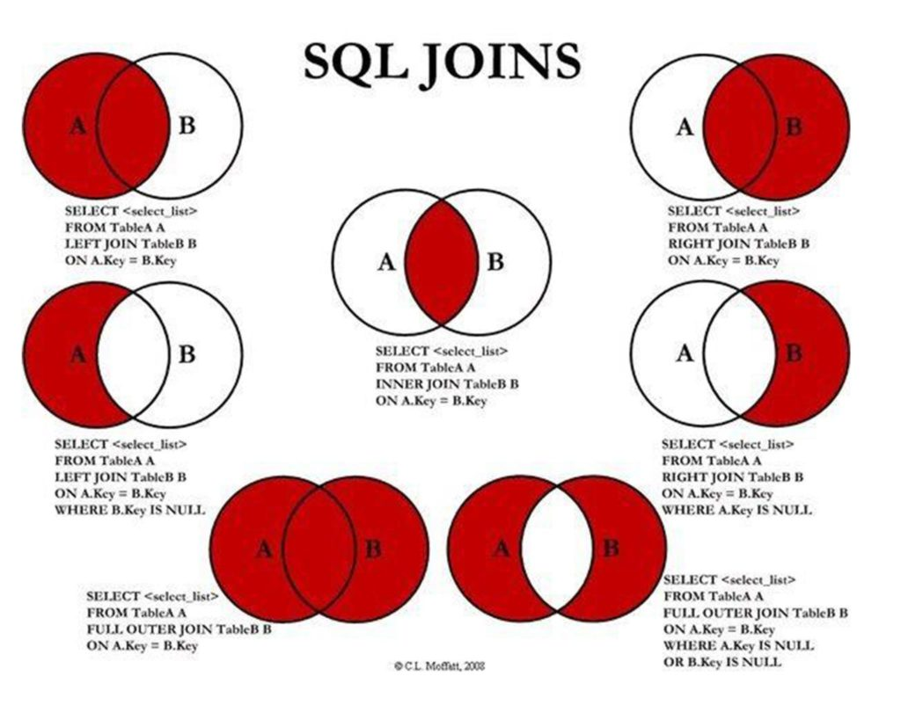

## O que é um JOIN em banco de dados e para que ele é usado?

Similar a uma expressão de junção em algebra linear, uma cláusula JOIN, combina colunas de uma ou mais tabelas em um banco de dados.

Dentro que chamamos de junção, temos alguns comandos comuns como, JOIN: INNER JOIN, LEFT JOIN, RIGHT JOIN, FULL JOIN e CROSS JOIN.

A imagem abaixo representa esses comandos mais comuns.

## Group by

